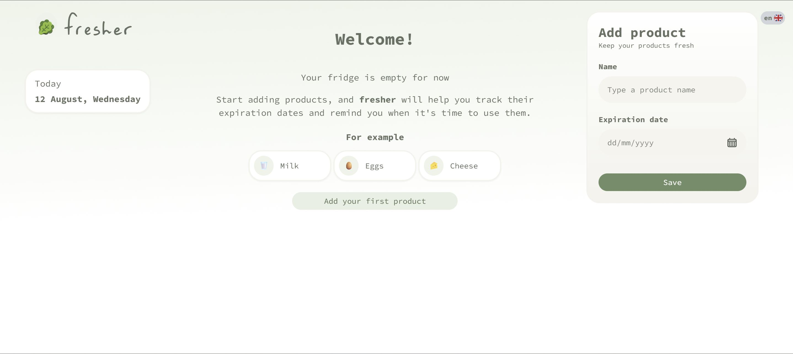
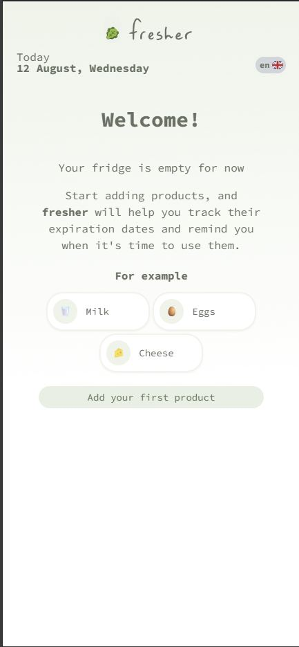
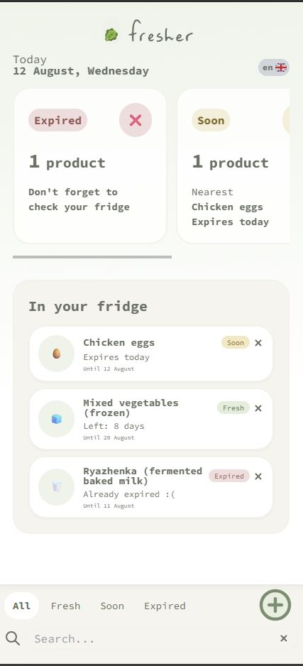
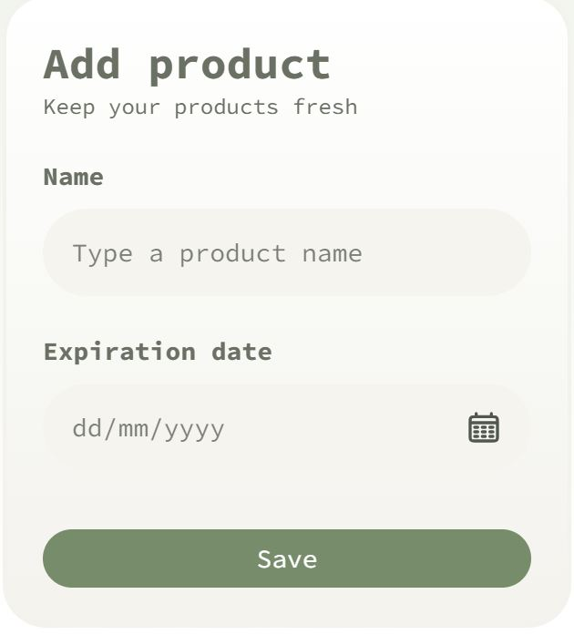

[🇬🇧 English](README.md) | [🇷🇺 Русский](README.ru.md)

# Fresher - Fridge Tracker

A simple bilingual app for tracking food expiration dates
and reducing food waste



### 🔗 Links

- **Live Demo:** [fresher-mu.vercel.app](https://fresher-mu.vercel.app/)
- **Repository:** [GitHub](https://github.com/MallonsoFrey/Fresher--fridge-tracker)

---

## Screenshots

### Main screen

  

### Main screen - Mobile version

  

### Added products - Mobile version
  

### Add product form

  

---

## About the project

Fresher was created to solve a simple everyday problem:
it is easy to forget about food products hidden in the fridge
until they expire.

The application helps users quickly understand:

- what products they currently have;
- which products are expiring soon;
- which products have already expired.

**Features**

The interface is intentionally simple and focused on the most
important information rather than overwhelming the user with data.

- **Multi-language:** interface in Russian and English, switchable via the UI.
- **Add & Search:** quick product addition and search by name.
- **Expiry tracking:** product status (fresh/soon/expired) and number of days.
- **Stats:** cards showing expiry dates and summary metrics.
- **Responsive UI:** works on mobile and desktop devices.

## Tech Stack

**Core**

- React
- TypeScript
- Vite

**Styling**

- Tailwind CSS

**UI**

- React Day Picker

**State management**

- Zustand
- localStorage

**Internationalization**

- i18next / react-i18next

**Deployment**

- Vercel

**Run locally**

```bash
git clone https://github.com/MallonsoFrey/Fresher--fridge-tracker.git
cd Fresher--fridge-tracker
npm install
npm run dev
```

### Production build

```bash
npm run build
```

---

## Roadmap

- Recipe recommendations based on available products
- Expiration reminders
- Barcode scanning
- Shopping list
- Product categories
- User accounts and cloud synchronization
