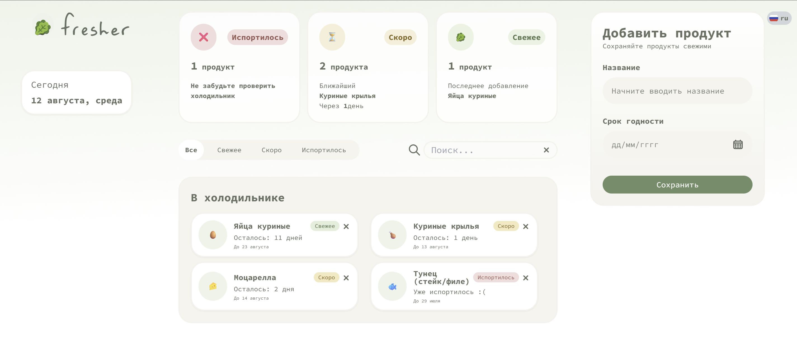
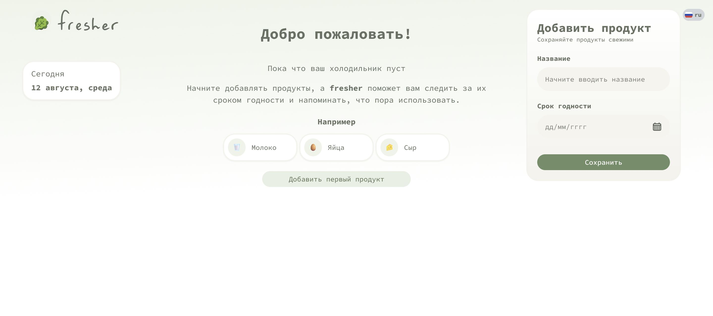
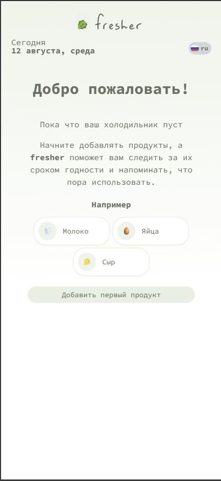
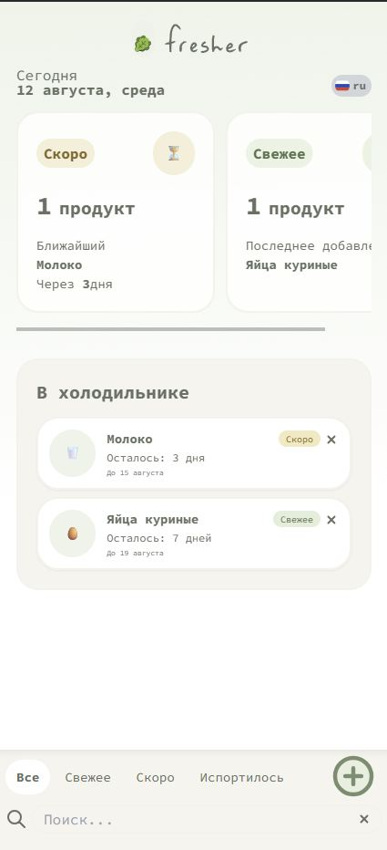
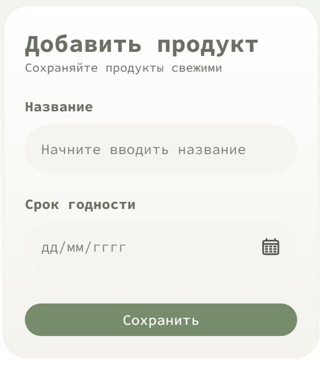

[🇬🇧 English](README.md) | [🇷🇺 Русский](README.ru.md)

# Fresher - Fridge Tracker

Простое приложение на двух языках для контроля сроков годности. Помогает вовремя съедать купленное, экономить бюджет и осознанно относиться к продуктам.



### 🔗 Links

- **Live Demo:** [fresher-mu.vercel.app](https://fresher-mu.vercel.app/)
- **Repository:** [GitHub](https://github.com/MallonsoFrey/Fresher--fridge-tracker)

---

## Скриншоты

### Основной экран



### Основной экран - Мобильная версия



### Добавленные продукты - Мобильная версия 



### Форма добавления




## О проекте

Приложение Fresher было создано для решения простой повседневной проблемы:
о продуктах, спрятанных в холодильнике, легко забыть,
пока они не просрочатся.

Приложение помогает пользователям быстро понять:

- какие продукты у них есть на данный момент;
- срок годности каких продуктов скоро истечет;
- срок годности каких продуктов уже истек.

Интерфейс намеренно прост и сосредоточен на самой
важной информации, а не на том, чтобы перегружать пользователя данными.

**Features**

- **Многоязычность:** интерфейс на русском и английском, переключение через UI.
- **Добавление и поиск:** быстрое добавление продукта и поиск по названию.
- **Отслеживание сроков:** статус продукта (fresh/soon/expired) и количество дней.
- **Статистика:** карточки с датами окончания срока и суммарные показатели.
- **Адаптивный интерфейс:** работает на мобильных и десктопах.

## Доступность

- Интерактивные элементы, доступные с клавиатуры
- Видимые состояния фокуса
- Семантический HTML и правильно привязанные метки форм
- Доступные имена для элементов управления, состоящих только из значков
- Тщательно продуманный цветовой контраст и удобная для чтения типографика

## Tech Stack

**Core**

- React
- TypeScript
- Vite

**Styling**

- Tailwind CSS

**UI**

- React Day Picker

**State management**

- Zustand
- localStorage

**Internationalization**

- i18next / react-i18next

**Deployment**

- Vercel

**Запуск локально**
```bash
git clone https://github.com/MallonsoFrey/Fresher--fridge-tracker.git
cd Fresher--fridge-tracker
npm install
npm run dev
```

### Production build

```bash
npm run build
```

---

## План развития

- Рекомендации по рецептам с учетом имеющихся продуктов
- Напоминания о сроках годности
- Сканирование штрих-кодов
- Список покупок
- Категории товаров
- Пользовательские аккаунты и синхронизация с облаком